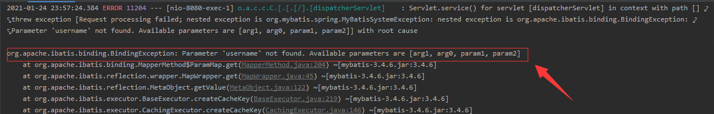
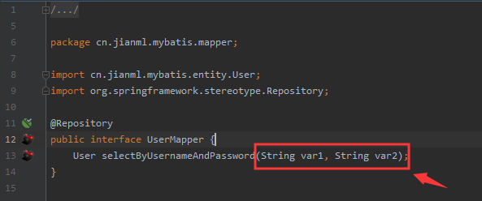
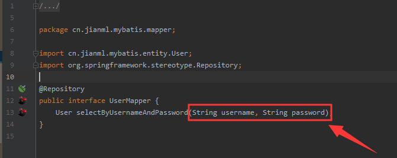

# Mybatis的Mapper方法不使用@Param注解报错的问题分析

### 问题描述

Mybatis的Mapper中多参数方法，没有用@Param注解，同样的代码，有时候运行没有问题，有时候运行会报如下错误：



### 代码

`User.java`

```java
@Data
public class User {
    private Long id;

    private String username;

    private String password;
}
```

`UserMapper.java`

```java
@Repository
public interface UserMapper {
    User selectByUsernameAndPassword(String username, String password);
}
```

`UserMapper.xml`

```xml
<select id="selectByUsernameAndPassword" resultType="cn.jianml.mybatis.entity.User">
	select * from t_user where username = #{username} and password = #{password}
</select>
```

### 原因分析

调用一个具有多参数的mapper接口方法，对这个方法的调用其实是对mapper对应的xml中的一个sql的调用，并且我们在这个sql语句中使用#{方法参数名称}的方式构建动态SQL，但是要想在sql语句中使用参数名称获取参数值那么需要对mapper接口对应方法的每一个参数使用@Param注解，Param注解源代码如下：

```java
@Documented
@Retention(RetentionPolicy.RUNTIME)
@Target(ElementType.PARAMETER)
public @interface Param {
  String value();
}
```

它只有一个value属性，这里的value就等于mapper对应的xml文件中获取参数值时要使用的key。于是我找到了对应报错的代码发现正是因为多参数方法没有使用@Param注解，在加上该注解后便没有错误了。

**到此时问题虽然已经解决了，但是还没有找到问题的根源**

之前我没有给mapper多参数方法加上@Param注解，调用该方法**并非一定报错**，所以问题的根源应该不在@Param注解这里

这时候需要去分析mybatis的源码了，在mybatis执行过程中，有一个**声明参数名称解析器**会解析Mapper方法中的参数信息，其构造方法如下：

```java
public ParamNameResolver(Configuration config, Method method) {
    final Class<?>[] paramTypes = method.getParameterTypes(); // 方法参数列表
    final Annotation[][] paramAnnotations = method.getParameterAnnotations(); // 参数的注解信息
    final SortedMap<Integer, String> map = new TreeMap<Integer, String>();
    int paramCount = paramAnnotations.length;
    for (int paramIndex = 0; paramIndex < paramCount; paramIndex++) {
        /* 特殊参数忽略 */
        if (isSpecialParameter(paramTypes[paramIndex])) {
            continue;
        }
        String name = null;
        for (Annotation annotation : paramAnnotations[paramIndex]) {
            if (annotation instanceof Param) {
                hasParamAnnotation = true;
                // 如果参数注解了@Param，获取注解的value属性值
                name = ((Param) annotation).value();
                break;
            }
        }
        if (name == null) {
            // 默认为true，可以配置
            if (config.isUseActualParamName()) {
                // 反射获取参数的真实名称
                name = getActualParamName(method, paramIndex);
            }
            if (name == null) {
                // 这些都执行完成如果name还是null，这时用参数的下标作为name，也就是说name等于当前方法参数的位置（“0”, “1”, …）
                name = String.valueOf(map.size());
            }
        }
        map.put(paramIndex, name); // 下标和name做映射
    }
    names = Collections.unmodifiableSortedMap(map);
}
```

其中getActualParamName(method, paramIndex)的值由config.isUseActualParamName()决定

useActualParamName参数的含义如下

| 设置名             | 描述                                                         | 有效值          | 默认值 |
| ------------------ | ------------------------------------------------------------ | --------------- | ------ |
| useActualParamName | 允许使用方法签名中的名称作为语句参数名称。 为了使用该特性，你的项目必须采用 Java 8 编译，并且加上 -parameters 选项。（新增于 3.4.1） | true 或者 false | true   |

> 官方文档：https://mybatis.org/mybatis-3/zh/configuration.html#settings

Mybatis 3.4.2版本之前设置属性中`useActualParamName`参数的默认值为`flase`，3.4.2版本之后设置属性中`useActualParamName`参数的默认值为`true `

在jdk1.8之前，JAVA代码编译为class文件后，方法参数的类型固定，但是参数名称会丢失，所以当通过反射去获取方法参数名称的时候是不能够得到原本源代码中的参数名称的，Java编译器会丢掉这部分信息。从jdk1.8开始可以通过在编译时添加-parameters这个选项来明确告诉编译器我们需要保留方法参数的原本名称。

#### 测试

编译java代码时没有添加-parameter选项：



添加-parameter选项后编译：

